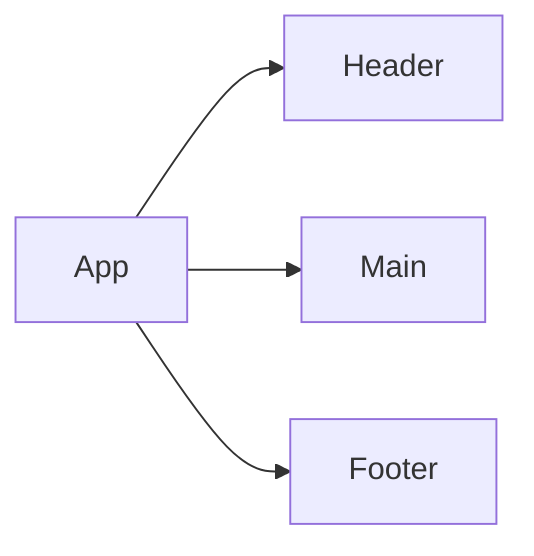

*A PRD (Product Requirements Document) is created before creating a product or feature and includes the planning required for developers to execute effectively. This document is usually prepared by Product Managers, read more [here](https://www.atlassian.com/agile/product-management/requirements)*

# Product Requirements Documentation

**Summary**
| Field | Detail |
|-------|--------|
| Project Name | Red Planet Express|
| Description | A shipping service to Mars |
| Developers | Joshua Goss |
| Live Website | TBD |
| Repo | https://github.com/Banditolabs/Red-Planet-Express |

## Problem Being Solved and Target Market

There is currently a need for a way that people can ship both themselves and their items to Mars. Our company is Earchs premier Mars shipping service.

## User Stories

List of stories users should experience when using your application.

- Users can see upcomming launch schedules
- Users can see current weather
- Random images will be on display on each visit.
- Users can input their item, it's wieght and get back a shipping cost

## Route Tables

For backend Applications you'll want to detail the different routes and types of your request your server can receive. There are three main things to define.

- The endpoint: the URL to which the request must be made
- The method: the type of http method the request should be
- The response: what the response should be, a web page, json data, etc.

You should also include any additional notes on any special headers that may be used and so forth.

| Endpoint | Method | Response | Other |
| -------- | ------ | -------- | ----- |
| https://api.nasa.gov/mars-photos/api/v1/rovers/curiosity/photos?sol=1000&api_key=${nasaKey} | GET | JSON of all items | N/A |
| https://fdo.rocketlaunch.live/json/launches/next/5 | GET | JSON of all items | N/A |
<!-- | /item/:id | GET | JSON of item with matching id number | |
| /item/:id | PUT | update item with matching idea, return its JSON | body must include updated data |
| /item/:id | DELETE | delete the item with the matching id | |
| /auth/signup | POST | creates new user account returns user JSON | new user info must be included in body |
| /auth/login | POST | logs in user and returns user JSON with JWT token | username and password must be included in body | -->

``

<!-- You can use the [Mermaid Markdown Syntax](https://mermaid-js.github.io/mermaid/#/flowchart) to create a chart of how the parts of your frontend website relate to each other. Units should represent components of your page. The following is an example you may see in a Single Page Application like a React App. -->

## User Interface Mockups

Mockflow https://wireframepro.mockflow.com/space/red-planet-express. 
<!-- If you need inspiration visit a site like [Behance](https://www.behance.net/?tracking_source=typeahead_search_direct&search=web%20mockup). 

 -->
