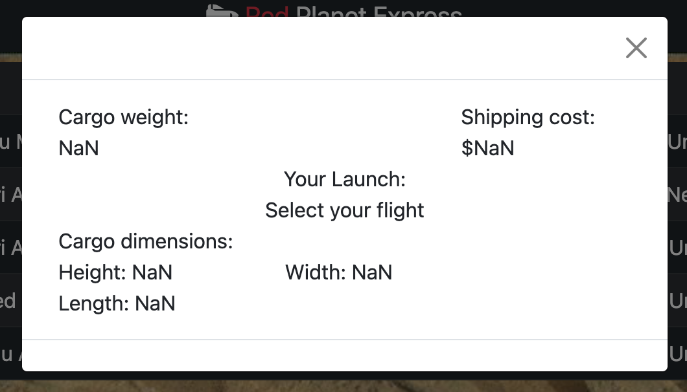

## [Product Requirements Document(PRD)](./docs/prd.md)

This document located in the docs folder should be filled out before starting your project to help you think through what your building. 

## Documenting Challenges and Solutions - Issues

Whenever you run into an issue you should create an issue on your repository (you'll see issues in the menu at the top of the screen). Create the issue and make comments as you learn new things to solve the problem. This becomes something that can help you and other users in the future.
``` javascript
let i = Math.floor(Math.random() * 856) //Should the max here be the length value of the array? 
    //How would I handel an array of unknown length?
```
``` jquery
firstSlide.attr("src",`${firstPic}`) 
```

## Technologies Used

*Javascript
*CSS
*HTML
*Bootstrap
*Jquery


## Screenshots





## Making a Backend Node app (expres/koa/fastify)

Make sure the package.json is at the top of this repo and that the start script is defined (heroku will run the start script unless something else specified in the Procfile.

## Making a React App

Set your terminal to the top of this repo (the folder this readme.md is in) and run `npx create-react-app@latest .` which will generate a react app in this folder.

## Getting started
(https://banditolabs.github.io/Red-Planet-Express/)
(https://github.com/Banditolabs/Red-Planet-Express)

## Future Enhancements

- Current weather for all the launch locations being pulled
- Validation checks on the package dimensions
- Reduce the data being pulled for the "date" of the launch table
- Calendar event integration so that people can book the flight into their Apple and Google calendar.
